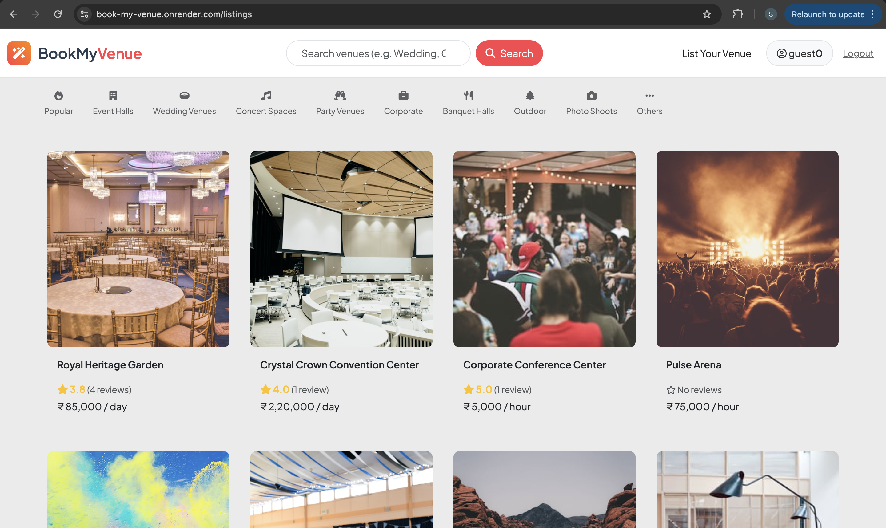
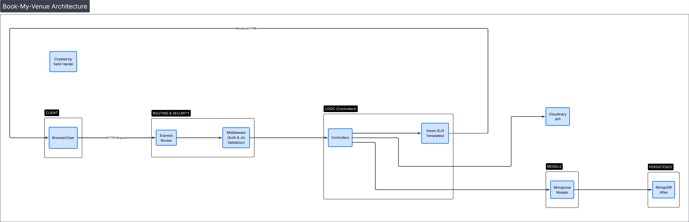

# 🏛️ Book My Venue

A comprehensive Full-Stack web application designed for discovering and booking event venues. From royal wedding palaces to minimal studio spaces, VenueNest provides a seamless platform for hosts to list their properties and for users to find the perfect location for their next event.


---

## 🚀 Live Demo
**[View Live Project on Render](https://book-my-venue.onrender.com)**

---

## ✨ Key Features

* **Dynamic Pricing Engine:** Supports localized pricing models tailored to the venue type (Wedding Lawns, Banquet Halls, etc.).
* **Full CRUD Functionality:** Authenticated users can Create, Read, Update, and Delete venue listings with ease.
* **Advanced Image Management:** Integrated with **Cloudinary API** for robust cloud storage, featuring automatic image resizing and optimizations.
* **Secure Authentication:** Robust user login and signup system powered by **Passport.js**.
* **Authorization & Security:** Custom middleware layers ensure only the venue owner can modify or delete their listings and reviews.
* **Review & Rating System:** Interactive community feedback loop with star ratings and detailed comments.
* **Search & Discovery:** Real-time search functionality to filter venues by category, location, or country.

---

## 🛠️ Technical Stack

**Frontend:**
* **EJS (Embedded JavaScript):** For dynamic server-side rendering.
* **Bootstrap 5:** Modern, responsive design and UI components.
* **FontAwesome:** Professional iconography for categories and UI elements.

**Backend:**
* **Node.js & Express.js:** Fast and scalable server-side architecture.
* **Mongoose (ODM):** Complex data modeling with nested objects and relationships.
* **Joi:** Strict server-side schema validation to ensure data integrity.
* **Multer & Multer-Storage-Cloudinary:** Handling `multipart/form-data` and seamless cloud uploads.

**Database:**
* **MongoDB Atlas:** Distributed cloud database for reliable, persistent storage.

---

## 🛡️ Security & Validation

* **Server-Side Validation:** All data is sanitized and validated using **Joi** schemas before reaching the database.
* **Authentication:** Managed via **Passport.js**, ensuring secure session handling.
* **Authorization:** Custom middleware ensures that users can only modify or delete their own listings and reviews, preventing unauthorized access.


---

## 🏗️ Architectural Overview (MVC)

The project follows the **Model-View-Controller** design pattern to ensure clean separation of concerns and maintainability:



1.  **Models:** Defined schemas for Listings, Reviews, and Users with Mongoose.
2.  **Views:** Responsive EJS templates using Boilerplate layouts and EJS-Mate.
3.  **Controllers:** Modularized logic for handling requests, ensuring the code remains DRY (Don't Repeat Yourself).
4.  **Routes:** RESTful API routes for predictable and clean navigation.


[Image of Model-View-Controller architecture diagram]


---

## 📁 Project Directory Structure

```text
.
├── controllers/    # Route handlers and business logic
├── init/           # Database seeding scripts and sample data
├── models/         # Mongoose schemas (Listing.js, Review.js, User.js)
├── public/         # Static assets (Custom CSS and Client-side JS)
├── routes/         # Express router files
├── utils/          # Error classes and custom utility functions
├── views/          # EJS templates (layouts, includes, and pages)
├── app.js          # Main application entry point
├── cloudConfig.js  # Cloudinary configuration
├── middleware.js   # Auth and Authorization checks
├── schema.js       # Joi validation schemas
├── .gitignore      # Specifies intentionally untracked files to ignore
└── .env            # Private environment variables (DO NOT PUSH TO GITHUB)


---

## 🔧 Installation & Setup

To get a local copy up and running, follow these simple steps:

1.  **Clone the Repo:**
    ```bash
    git clone [https://github.com/sahilcommit/book-my-venue.git](https://github.com/sahilcommit/book-my-venue.git)
    cd book-my-venue
    ```

2.  **Install Dependencies:**
    ```bash
    npm install
    ```

3.  **Environment Variables:**
    Create a `.env` file in the root directory and add your credentials:
    ```env
    CLOUD_NAME=your_cloudinary_name
    CLOUD_API_KEY=your_api_key
    CLOUD_API_SECRET=your_api_secret
    ATLASDB_URL=your_mongodb_atlas_url
    SECRET=your_session_secret_key
    ```

4.  **Run the App:**
    ```bash
    # Using nodemon for development
    nodemon app.js
    
    # Or using node
    node app.js
    ```

---

## 🛡️ Security & Validation

* **Server-Side Validation:** All data is sanitized and validated using **Joi** schemas before reaching the database.
* **Authentication:** Managed via **Passport.js**, ensuring secure session handling.
* **Authorization:** Custom middleware ensures that users can only modify or delete their own listings and reviews, preventing unauthorized access.


---

## 🤝 Contributing

Contributions are what make the open-source community such an amazing place to learn, inspire, and create. Any contributions you make are **greatly appreciated**.

1. Fork the Project
2. Create your Feature Branch (`git checkout -b feature/AmazingFeature`)
3. Commit your Changes (`git commit -m 'Add some AmazingFeature'`)
4. Push to the Branch (`git push origin feature/AmazingFeature`)
5. Open a Pull Request

---

## 👤 Author

**Sahil Hande**
* **LinkedIn:** [sahil-hande-620931281](https://linkedin.com/in/sahil-hande-620931281)
* **GitHub:** [@sahilcommit](https://github.com/sahilcommit)

---

## 📄 License

This project is open-source. Feel free to use it for learning and portfolio purposes!